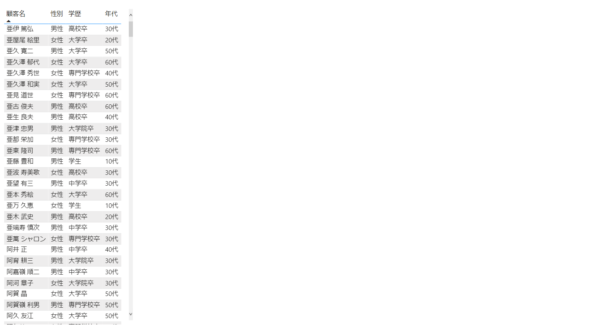
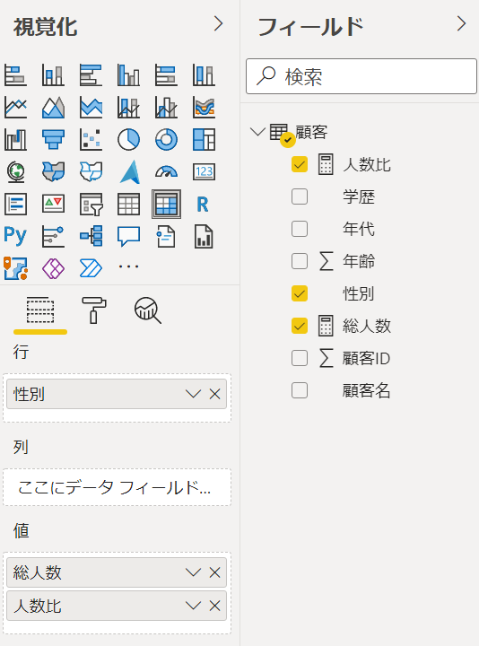

# Power BI Hands-on training 

## はじめてのレポートの作成

<br />

### **INDEX**

- [CSV ファイルからデータを読み込み](#CSV-ファイルからデータを読み込み)

- [レポート作成 (1)](#レポート作成-(1))

- [メジャーの作成](#メジャーの作成)

- [レポート作成 (2)](#レポート作成-(2))

- [比率を求めるメジャーの作成](#比率を求めるメジャーの作成)

- [レポート作成 (3)](#レポート作成-(3))

- [テーブルの追加](#テーブルの追加)

- [レポートの作成 (4)](#レポートの作成-(4))

<br />

### **CSV ファイルからデータを読み込み**

- Power BI Desktop を起動

- **データを取得** をクリックし、**テキスト/CSV** を選択

  

- **顧客.csv** を選択し、**開く** をクリック

- **元のファイル**、**区切り記号**、**データ型検出** を設定し、**読み込み** をクリック

  - **元のファイル**： **65001: Unicode(UTF-8)**

  - **区切り記号**： コンマ

  - **データ型検出**： 最初の 200 行に基づく

    

- レポートのモデルにデータが追加

  

<br />

### **レポート作成 (1)**

- **視覚化** の **テーブル** をクリック

  

- **値** に **顧客名**, **性別**, **学歴**, **年代** フィールドをドラッグ＆ドロップ

  

- テーブルに選択したフィールドの情報が表示

  

<br />

### **メジャーの作成**

- 画面左の **データ**（）をクリック

- **新しいメジャー** をクリック

  

- 顧客の総数を求めるメジャーを作成

  ```
  総人数 = COUNTROWS('顧客') 
  ```

- **書式設定** の **,** をクリック

  

<br />

### **レポート作成 (2)**

- 画面左の **レポート**（）をクリック

- **視覚化** の **カード** をクリックし、レポートへ配置

  

- **フィールド** に **顧客** の **総人数** をドラッグ＆ドロップ

  

- 大きさを調整し、テーブルの左へ配置

  

- **視覚化** の **マトリックス** をクリックして、レポートへ配置

  

- **行**、**値** にフィールドをドラッグ＆ドロップ

  **行**： **顧客** - **性別**

  **値**： **顧客** - **総人数**

  

- 大きさを調整し、カードの下に配置

  

<br />

### **比率を求めるメジャーの作成**

- 画面左の **データ**（）をクリック

- **新しいメジャー** をクリック

  

- 以下の式を入力し Enter キーを押下

  ```
  人数比 = DIVIDE([総人数], CALCULATE([総人数], REMOVEFILTERS()))
  ```

- **メジャー ツール** タブを選択

  **書式設定** の **書式** を **パーセンテージ** に設定

  

- 画面左の **レポート**（）をクリック

- レポート上のマトリックスを選択

- **値** に **顧客** の **人数比** をドラッグ＆ドロップ

  

- マトリックスに人数比が表示

  

- **行** に **顧客** - **年代** をドラッグ＆ドロップ

  

- **書式**（）をクリック

- **行見出し** を展開し、**階段状レイアウト** を **オフ** に設定

  

- マトリックスの「」をクリック

  

- 行に指定されたフィールドをドリルダウンして表示

  

- 画面左の **データ**（）をクリック

- **新しいメジャー** をクリック

  

- 以下の式を入力し Enter キーを押下

  ```
  総人数 ％ 年代 = DIVIDE([総人数], CALCULATE([総人数], REMOVEFILTERS('顧客'[年代])))
  ```

- **メジャー ツール** タブを選択

  **書式設定** の **書式** を **パーセンテージ** に設定

  

- レポート上のマトリックスを選択

- **値** に **顧客** の **総人数 % 年代** をドラッグ＆ドロップ

  

- 性別の年代比が表示

  

- 画面左の **データ**（）をクリック

- **新しいメジャー** をクリック

  

- 以下２つのメジャーを作成

  ```
  総人数 % 性別 = DIVIDE([総人数], CALCULATE([総人数], REMOVEFILTERS('顧客'[性別]))) 
  ```

  ※ 性別フィルターを除外した比率

  ```
  総人数 % 学歴 = DIVIDE([総人数], CALCULATE([総人数], REMOVEFILTERS('顧客'[学歴]))) 
  ```

  ※ 学歴フィルターを除外した比率

- **メジャー ツール** タブの書式設定で作成したメジャーの書式を **パーセンテージ** に設定

  

- 画面左の **モデル**（）をクリック

  

- 画面右のフィールド欄で作成した５つのメジャーを選択

  

- **プロパティ** の **フォルダーの表示** に **メジャー** と入力

  

  ※論理的にフィールドをグループ化

- 画面右のフィールド欄で作成した **年齢** と **顧客ID** を選択

- **プロパティ** の **非表示** を **はい** に設定

  

  ※レポート作成に使用しないフィールドを非表示に設定

<br />

### **レポート作成 (3)**

- 画面左の **レポート**（）をクリック

- **視覚化** の **マトリックス** をクリックして、レポートへ配置

  

- **行**、**値** にフィールドをドラッグ＆ドロップ

  - **行**： **顧客** - **性別**, **学歴**

  - **値**： **顧客** - **総人数**, **総人数 % 学歴**, **人数比**

  

- **書式**（）をクリック

- **行見出し** を展開し、**階段状レイアウト** を **オフ** に設定

  

- マトリックスの「」をクリック

- 行に指定されたフィールドをドリルダウンして表示

  

- ここまでの操作で作成したレポート

  

-  テーブルをクリックして選択

- **視覚化** の **複数の行カード** をクリック

  

- テーブルからカードへ変更

  

- マトリックス上のフィールドをクリックすると、レポート上の各視覚化コンポーネントにフィルターが適用

  

<br />

### **テーブルの追加**

- **ホーム** タブの **データの変換** をクリック

  

- Power Query エディターが起動

- **新しいソース** をクリックし **Excel ブック** を選択

  

- **売上データ.csv** を選択し **開く** をクリック

- **元のファイル**、**区切り記号**、**データ型の検出** を確認し、**OK** をクリック

  - **元のファイル**： **65001: Unicode (UTF-8)**

  - **区切り記号**： コンマ

  - **データ型の検出**： 最初の 200 行に基づく

    

- 同様の操作で **商品.csv** へ接続

  - **元のファイル**： **65001: Unicode (UTF-8)**

  - **区切り記号**： コンマ

  - **データ型検出**： 最初の 200 行に基づく

    

- ** ホーム** タブの **閉じて適用** をクリック

  レポートへデータを読み込み

- 画面左の **モデル**（）をクリック

- **売上データ** と **顧客**, **商品** テーブルが関連付けられていることを確認

  

  ※同名の列がある場合は、自動的にリレーション シップを作成

- 画面左の **データ**（）をクリック

- 画面左のフィールドで **売上データ** - **売上** を選択

  

- **書式** を **通貨** に変更 

  

- ＄ 左の矢印をクリックし **￥ 日本語 (日本)** を選択

  

- **テーブル ツール** タブを選択し、**新しいメジャー** をクリック

  

- SUM 関数を使用し売上合計のメジャーを作成

  ```
  売上合計 = SUM('売上データ'[売上]) 
  ```

- **書式** を **通貨** に設、**通貨単位** を **￥ 日本語 (日本)** に設定

  

- 同様の手順で **数量** メジャーを作成

  ```
  数量 = COUNTROWS('売上データ') 
  ```

- 書式設定で **,** をクリックし、３桁区切り記号のコンマをつけて表示するよう設定

  

<br />

### **レポートの作成 (4)**

- 画面左の **レポート**（）をクリック

- 画面したの「＋」をクリックし、ページを追加

  

- **視覚化** の **カード** をクリックし、レポートへ配置

  

- **フィールド** へ **売上データ** - **売上合計** をドラッグ＆ドロップ

  

- **書式**（）をクリック

- **データ ラベル** を展開し **表示単位** を **千** に設定

  

- **視覚化** の **カード** をクリックし、レポートへ配置

- **フィールド** へ **売上データ** - **数量** をドラッグ＆ドロップ

  

- **書式**（）をクリック

- **データ ラベル** を展開し **表示単位** を **なし** に設定

  

- 大きさを調整し、画面左上に並べて表示

  

- 視覚化の **スライサー** をクリックして配置

  

- フィールドに **商品** の **カテゴリ** をドラッグ＆ドロップ

  

- **全般** を展開し **方向** を **横** に設定

  

- 大きさを調整し、カードの左側に配置

  

- 視覚化の **スライサー** をクリックして配置

  

- フィールドに **売上データ** の **日付の階層** - **年** をドラッグ＆ドロップ

  

- 大きさを調整し、先の手順で作成したスライサーの左に配置

  
