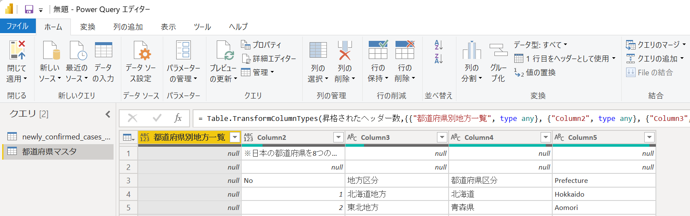
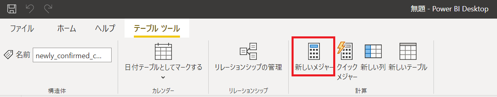
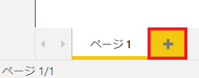
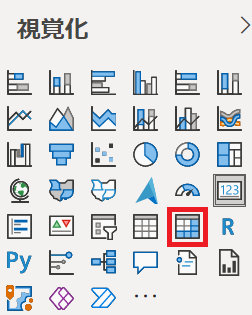
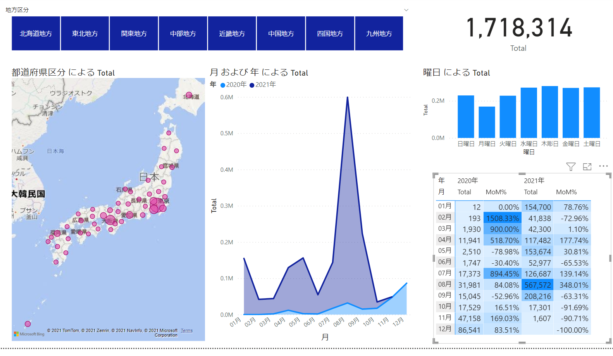

# Power BI Hands-on training

## オープンデータを使用したレポートの作成

<br />

### **INDEX**

- [オープンデータの取得](#オープンデータの取得)

- [CSV ファイルからデータを読み込み](#CSV-ファイルからデータを読み込み)

- [レポートの作成（1）](#レポートの作成（1）)

- [Excel ファイルからデータを取得](#Excel-ファイルからデータを取得)

- [日付テーブルの作成](#日付テーブルの作成)

- [データ モデリング](#データ-モデリング)

- [レポートの作成（2）](#レポートの作成（2）)

<br />

### **オープンデータの取得**

- [厚生労働省](#https://www.mhlw.go.jp/stf/covid-19/open-data.html) のサイトへアクセス

- **新規陽性者数の推移（日別）** をクリックし、CSV ファイルをダウンロード

<br />

### **CSV ファイルからデータを読み込み**

- Power BI Desktop を起動

- **データを取得** をクリックし、**テキスト/CSV** を選択

  

- ダウンロードした **newly_confirmed_cases_daily.csv** を選択し **開く** をクリック

- 文字コード、区切り記号、データ型検出の値を確認し、**データ変の換** をクリック

  - **元のファイル**： **65001: Unicode (UTF-8)**

  - **区切り記号**： **コンマ**

  - **データ型検出**： 最初の 200 行に基づく

    

- Power Query エディターが起動

  

- **Prefecture** 列の「**▼**」をクリック

- **ALL** のチェックをし **OK** をクリック

  

- 行った操作が **適用したステップ** に記録されることを確認

  

  ※ 次回以降もデータ読み込み時に同様の操作を実行

- **閉じて適用** をクリック

  

- データを読み込み

  画面右のフィールドに取得したデータが表示

  

<br />

### **レポートの作成（1）**

- **視覚化** の **折れ線グラフ** をクリックしてレポートに配置

  

- **軸** に **Date**, **値** に **Newly confirmed cases** をフィールドからドラッグ＆ドロップ

  

- 折れ線グラフが画面の半分くらいの大きさとなるよう、幅と高さを調整

  

- 「」を３回クリックし、軸を日までドリルダウン

  

- レポートの空白部分をクリック

  **視覚化** の **集合横棒グラフ** をクリックしてレポートに配置

  

- **軸** に **Prefecture**, **値** に **Newly confirmed cases** をフィールドからドラッグ＆ドロップ

  

  

- ページ1 の完成

  

<br />

### **Excel ファイルからデータを取得**

- **ホーム** タブの **データの変換** をクリック

  

- Power Query エディターが起動

- **新しいソース** をクリックし **Excel ブック** を選択

  

- **都道府県.xlsx** を選択し **開く** をクリック

- ナビゲーター ダイアログで **都道府県マスタ** をチェックし、**OK** をクリック

  

- **クエリ** に **都道府県マスタ** が追加

  

- **行の削除** をクリックし **上位の行の削除** を選択

  

- 行数に **2** を入力し **OK** をクリック

  

- 不要な２行が削除

  

- **都道府県別地方一覧** 列を選択し、**列の削除** - **列の削除** をクリック

  

- **１行目をヘッダーとして使用** をクリック

  

- **No** 列を選択

  **変換** タブの **名前の変更** をクリック

  

- 列名を **地方区分No** に変更

  

- **Ctrl** キーを押しながら **地方区分No** と **地方区分** 列を選択

  **フィル** をクリックし **下** を選択

  

- null 値が上の行の値で埋められることを確認

  

- **列の追加** タブの **インデックス列** をクリックし **１から** を選択

  

- インデックス列を選択したまま **変換** タブの **名前の変更** をクリック

- 列名を **都道府県No** に変更

  

- **都道府県No** 列をドラッグし、１番左へ移動

  

- **適用したステップ** に、ここまでの操作内容が記録

  

- **ホーム** タブの **閉じて適用** をクリック

  

- データがファイルから読み込まれ、レポートへ追加

  

<br />

### **日付テーブルの作成**

- 画面左の **データ**（）をクリック

- **新しいテーブル** をクリック

  

- **CALENDAR** 関数を入力し **日付マスタ** テーブルを作成

  ```
  日付マスタ = CALENDAR("2020/1/1", "2021/12/31")
  ```

  

- 指定した日付が入力された Date 列を持つテーブルが完成

  

- **新しい列** をクリック

  

- **YEAR** 関数を使用し「年」列を作成

  ```
  年 = YEAR('日付マスタ'[Date]) & "年" 
  ```

  

- **年** 列が追加

  

- 同様の手順で以下の列を作成

  - 「月」列

    ```
    月 = FORMAT('日付マスタ'[Date], "MM月")
    ```

  - 「曜日No」列

    ```
    曜日No = WEEKDAY('日付マスタ'[Date])
    ```

  - 「曜日」列

    ```
    曜日 = SWITCH(WEEKDAY('日付マスタ'[Date]), 1, "日曜日", 2, "月曜日", 3, "火曜日", 4, "水曜日", 5, "木彫日", 6, "金曜日", "土曜日")
    ```

  - 「半期No」列

    ```
    半期No = IF(MONTH('日付マスタ'[Date]) < 7, 1, 2)
    ```

  - 「半期」列

    ```
    半期 = IF(MONTH('日付マスタ'[Date]) < 7, "上半期", "下半期") 
    ```

  - 列を追加後のテーブル

    

- **曜日** 列を選択

  **列の並び替え** をクリックし**曜日No** を選択

  

- 同様の手順で **半期** 列を選択

  **列の並び替え** をクリックし **半期No** を選択

  

- **テーブル ツール** タブを選択

  **日付テーブルとしてマークする** をクリックし **日付テーブルとしてマークする** を選択

  

- **日付列** に **Date** を選択し **OK** をクリック

  

<br />

### **データ モデリング**

- **都道府県マスタ** を選択

- **都道府県区分** 列を選択

  **列の並び替え** をクリックし **都道府県No** を選択

  

- **地方区分** 列を選択

  **列の並び替え** をクリックし **地方区分No** を選択

  

- **newly_confirmed_cases_daily** を選択

- **新しいメジャー** をクリック

  

- 合計を算出する **Total** を作成

  ```
  Total = SUM('newly_confirmed_cases_daily'[Newly confirmed cases])
  ```

- 再度 **新しいメジャー** をクリックし、前月比を算出する **MoM%** メジャーを作成

  ```
  MoM% = DIVIDE('newly_confirmed_cases_daily'[Total], CALCULATE('newly_confirmed_cases_daily'[Total], DATEADD('日付マスタ'[Date], -1, MONTH))) - 1
  ```

- **書式設定** で **,（カンマ）** をクリック

  

- 画面左の **モデル**（）をクリック

- レポートに含まれるテーブルが表示

  

  ※ newly_confirmed_cases_daily テーブルと都道府県マスタの間にリレーションが設定されていることを確認

  ※ データ読み込み時に同名列を自動的に関連付け

- **日付マスタ** の **Date** 列を **newly_confirmed_cases_daily** テーブルの **Date** 列へドラッグ＆ドロップ

- newly_confirmed_cases_daily テーブルと日付マスタ間にリレーションが作成

  

- テーブル間のリレーションは **リレーションシップの管理** からも管理（作成/削除）が可能

  

<br />

### **レポートの作成（2）**

- 画面左の **レポート**（）をクリック

- 画面したの「＋」をクリックし、ページを追加

  

- 視覚化の **スライサー** をクリックして配置

  

- フィールドに **都道府県マスタ** の **地方区分** をドラッグ＆ドロップ

  

- **書式**（）をクリック

  **全般** を展開し **方向** を **横** に設定

  

- 幅、高さを調整

  

- **書式**（）をクリック

- **項目** を展開し、**フォントの色**、**背景** を任意の色に設定

  

  

  ※ 例：フォントの色：白、背景：テーマの色 2（#12239E）に設定

  - **表示** タブの **テーマ** から全体のデザインを変更することも可

    

- **視覚化** の **カード** をクリックし、レポートへ配置

  

- **フィールド** に **newly_confirmed_cases_daily** の **Total** をドラッグ＆ドロップ

  

- **書式**（）をクリック

- **データ ラベル** を展開し、**表示単位** を **なし** に設定

  

- 大きさを調整し、スライサーの右に配置

  

- **視覚化** の **マップ** をクリックし、レポートへ配置

  

- **場所** と **サイズ** にフィールドをドラッグ＆ドロップ

  場所： **都道府県マスタ** - **都道府県区分**

  サイズ： **newly_confirmed_cases_daily** - **Total**

  

- **書式**（）をクリック

- **データの色** を展開し、任意の色に設定

  

  ※ テーマの色 5（#E044A7）に設定

- 大きさを調整し、スライサーの下に配置

  

- **視覚化** の **積み上げ面グラフ** をクリックし、レポートへ配置

  

- **軸**、**凡例**、**値** にフィールドをドラッグ＆ドロップ

  **軸**： **日付マスタ** - **月**

  **凡例**： **日付マスタ** - **年**

  **値**： **newly_confirmed_cases_daily** - **Total**

  

- 積み上げ面グラフの左上にある **...** をクリック

  **軸の並べ替え** をクリックし **月** を選択

  

- 同様の手順で **軸の並べ替え** をクリックし **昇順で並べ替え** を選択

- 大きさを調整しマップの横に配置

  

- **視覚化** の **積み上げ法グラフ** をクリックして、レポートへ配置

  

- **軸**、**値** にフィールドをドラッグ＆ドロップ

  **軸**： **日付マスタ** - **曜日**

  **値**： **newly_confirmed_cases_daily** - **Total**

  

- 大きさを調整し、カードの下に配置

  

- **視覚化** の **マトリックス** をクリックして、レポートへ配置

  

- **行**、**列**、**値** にフィールドをドラッグ＆ドロップ

  **行**： **日付マスタ** - **月**

  **列**： **日付マスタ** - **年**

  **値**： **newly_confirmed_cases_daily** - **Total**, **MoM%**

  

- **書式**（）をクリック

- **小計** を展開し、**行の小計**、**列の小計** を **オフ** に設定

  

- **条件付き書式** を展開

  **Total** を選択し **背景色** を **オン** に設定

  

- 同様の手順で **MoM%** の **背景色** を **オン** に設定

  

- 大きさを調整し、積み上げ縦棒グラフの下に配置

  

- スライサーで任意の項目を選択

  マップ、グラフ、マトリックスにフィルター処理が適用されることを確認

  

- ファイル メニューで名前を付けて保存を実行し、終了
