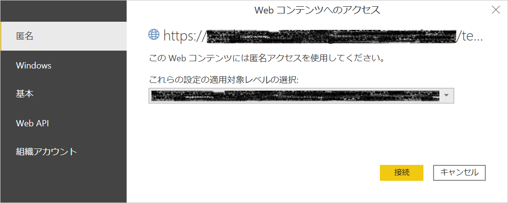
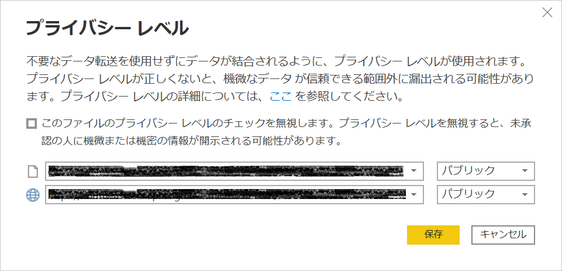
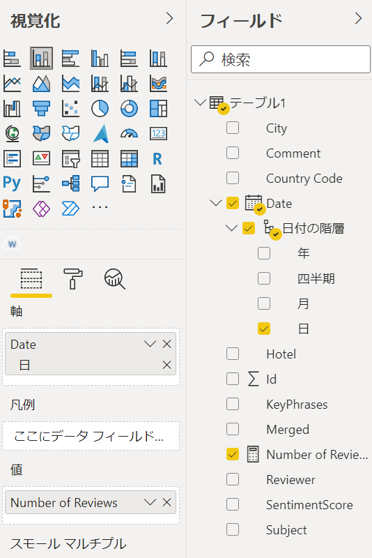

# Power BI Hands-on training

## Power BI Desktop での Cognitive Services の利用

<br />

### **INDEX**
- [CSV ファイルからデータを取得](#CSV-ファイルからデータを取得)

- [Power BI ビジュアルの追加](#Power-BI-ビジュアルの追加)

- [ワード クラウドの作成](#ワード-クラウドの作成)

- [Cognitive Services の Text Analytics を使用したキーフレーズ抽出](#Cognitive-Services-の-Text-Analytics-を使用したキーフレーズ抽出)

- [レポートの完成](#レポートの完成)

<br />

### **CSV ファイルからデータを取得**

- Power BI Desktop を起動

- **データを取得** - **テキスト/CSV** をクリック

  

- **reviews.xlsx** を選択し **開く** をクリック

- ナビゲーター画面が表示

  **テーブル1** を選択し、**読み込み** をクリック

  

- データにテーブル1が追加

  

<br />

### **Power BI ビジュアルの追加**

- 視覚化の **...** をクリックし、**その他のビジュアルを取得** を選択

  

- Power BI のビジュアル画面が表示

  画面右上の検索ボックスに **word cloud** と入力

  フィルター処理された結果から **Word Cloud** をクリック

  

- **今すぐ入手** をクリック

  

- **正常にインポートされました** の通知が表示されるので **OK** をクリック

  

- 視覚化に Word Cloud のアイコンが追加されることを確認

  

<br />

### **ワード クラウドの作成**

- 視覚化で追加した Word Cloud のアイコンをクリック

  

- フィールドから **テーブル1** の **Comment** を **カテゴリ** へドラッグ＆ドロップ

  

- レポート上で Word Cloud の高さ、幅を調整

  

  ※文章内の単語を可視化（頻出する単語ほど大きく表示）
  ※意味のない単語が多く含まれていることを確認

### **Cognitive Services の言語サービスを使用したキーフレーズ抽出**

- **ホーム** タブの **データの変換** をクリック

  

- Power Query エディターが起動

- **新しいソース** をクリックし **空のクエリ** を選択

  

- 名前を **KyePhrases** に変更

  

- **ホーム** タブの **詳細エディター** をクリック

  

- 詳細エディターに以下のコードを貼り付け

  ```
  (text) => let
      apikey      = "<YOUR_API_KEY>",
      endpoint    = "https://<YOUR_CUSTOM_DOMAIN>/text/analytics/v3.0/keyPhrases",
      jsontext    = Text.FromBinary(Json.FromValue(Text.Start(Text.Trim(text), 5000))),
      jsonbody    = "{ documents: [ { language: ""en"", id: ""0"", text: " & jsontext & " } ] }",
      bytesbody   = Text.ToBinary(jsonbody),
      headers     = [#"Ocp-Apim-Subscription-Key" = apikey],
      bytesresp   = Web.Contents(endpoint, [Headers=headers, Content=bytesbody]),
      jsonresp    = Json.Document(bytesresp),
      keyphrases  = Text.Lower(Text.Combine(jsonresp[documents]{0}[keyPhrases], ", "))
  in  keyphrases
  ```

  

  ※ **<YOUR_API_KEY>** と **<YOUR_CUSTOM_DOMAIN>** 使用する言語サービスのキーとエンドポイントへ変更

  

  ※ キーとエンドポイントは Azure ポータルより取得

- **完了** をクリック

- 画面左のクエリから **テーブル1** を選択

  

- **Ctr** キーを押しながら **Subject** 列と **Comment** 列をクリックし選択

  **列の追加** タブの **列のマージ** をクリック

  

- **区切り記号** と **新しい列名** を入力し **OK** をクリック

  - **区切り記号**： **タブ**

  - **新しい列名**： **Merged**

    

- Merged 列が追加

  

- **カスタム関数の呼び出し** をクリック

  

- **関数クエリ** で **KeyPhrases** を選択

  **text** に **Merged** 列を選択し **OK** をクリック

  

  - 「接続方法を指定してください」のバナーが表示された場合は、**資格情報の編集** ボタンをクリック

    

  - **Web コンテンツへのアクセス** ダイアログで **匿名** を選択し **接続** をクリック

    

  - 「データのプライバシーに関する情報が必要です」のバナーが表示された場合は **続行** ボタンをクリック

    

  - ダイアログ内の各データソースに対して **パブリック** を選択し **保存** をクリック
  

- **ホーム** タブの **閉じて適用** をクリック

  

- レポートにデータを読み込み

- Word Cloud の **カテゴリ** から Comment を削除

  **テーブル1** の **KeyPhrases** を **カテゴリ** にドラッグ＆ドロップ

  

- 頻出単語が変更されることを確認

  

<br />

### ****Cognitive Services の言語サービスを使用した感情分析**

- **ホーム** タブの **データの変換** をクリック

  

- Power Query エディターが起動

- **新しいソース** をクリックし **空のクエリ** を選択

  

- 名前を **Sentiment** に変更

  

- **ホーム** タブの **詳細エディター** をクリック

  

- 詳細エディターに以下のコードを貼り付け

  ```
  (text) => let
      apikey = "<YOUR_API_KEY>",
      endpoint = "https://<YOUR_CUSTOM_DOMAIN>" & "/text/analytics/v3.1/sentiment",
      jsontext = Text.FromBinary(Json.FromValue(Text.Start(Text.Trim(text), 5000))),
    　jsonbody = "{ documents: [ { language: ""en"", id: ""0"", text: " & jsontext & " } ] }",
    　bytesbody = Text.ToBinary(jsonbody),
    　headers = [#"Ocp-Apim-Subscription-Key" = apikey],
    　bytesresp = Web.Contents(endpoint, [Headers=headers, Content=bytesbody]),
    　jsonresp = Json.Document(bytesresp),
    　sentiment   = jsonresp[documents]{0}[sentiment] 
    　in sentiment
  ```

  

  ※ **<YOUR_API_KEY>** と **<YOUR_CUSTOM_DOMAIN>** 使用する言語サービスのキーとエンドポイントへ変更

- **カスタム関数の呼び出し** をクリック

  

- **カスタム関数の呼び出し** ダイアログで以下の設定を行い **OK** をクリック

  - **新しい列名**： **SentimentScore**

  - **関数クエリ**： **Sentiment**

  - **text**： **Merged**

    

- **ホーム** タブの **閉じて適用** をクリック

  

- レポートにデータを読み込み

- 画面左のデータ（）をクリック

- **新しいメジャー** をクリック

  

- 以下の式を入力

  ```
  Number of Reviews = COUNTROWS('テーブル1')
  ```

  

- **Enter** キーを押下し、メジャーを作成

  

- 画面左のレポート（）をクリック

- 視覚化の **積み上げ縦棒グラフ** をクリックして配置

  

- 積み上げ縦棒グラフのフィールドを設定

  - **軸**： **日**

  - **値**： **Numer or Reviews**

  

  

- **凡例** に **SentimentScore** をドラッグ＆ドロップ

  

  

<br />

### **レポートの完成**

- Word Cloud, 積み上げ縦棒グラフの高さを調整し、画面上部に空白を作成

  

- 視覚化の **スライサー** をクリックして配置

  

- フィールドに **Hotel** をドラッグ＆ドロップ

  

- **書式**（）をクリック

  **全般** を展開し **方向** を **横** に設定

  

- スライサーの高さ、幅を調整

  

- スライサーの項目を選択

  Word Cloud, 積み上げ縦棒グラフの双方にフィルター処理が適用されることを確認

  

- Word Cloud のフォーカス モード（）をクリック

  

  ※ Word Cloud が拡大して表示されることを確認

- **ファイル** メニューの **名前を付けて保存** を選択し、ファイルを保存
